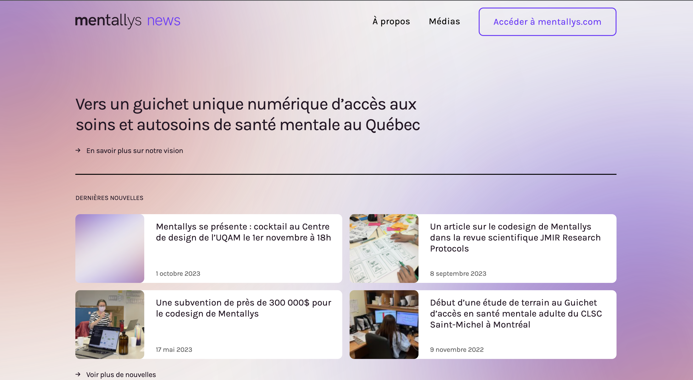

# Développeur logiciel

## 📚 Education
Baccalauréat en Informatique et Génie logiciel, UQAM

## ✅ Compétences
Python(Flask)  
Javascript(Angular)  
SQL(MySQL)  
HTML/CSS  
Java(Spring Boot)  
Git  
Wordpress  
Prévention de vulnérabilités logicielles  

## 📐 Projets

[Mentallys News](https://news.mentallys.com)  

## 💼 Expérience

### 🔹  Conseiller d'accueil Crédit mutuel
Accueillir les clients.  
Orienter et informer les clients.  
Traiter les opérations de guichet à partir de l'application TAG.  
Donner les premiers conseils.  
Vendre les produits de base.  
Gérer le stock de cartes et de chéquiers.  
Traiter le courrier interne et externe.  
Faire du Phoning l'après-midi ou autre activité commerciale.  

### 🔹 Stage service informatique GFA Caraïbes
Rédiger les procédures visant à assurer le respect de la législation en matière deprotection de données personnelles.  
Conseiller les services de l’entreprise sur les aspects juridiques et protectiondes données personnelles.  
Contribuer à la complétude et à la cohérence des registres de traitement de GFAC.  
Suivi des différents projets de l'entreprise.    
Effectuer le suivi des analyses d'impact.  

